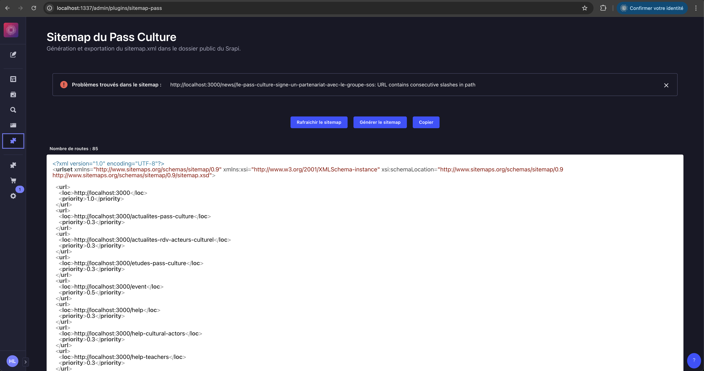

# Sitemap Pass Plugin

Plugin Strapi qui génère automatiquement un sitemap XML pour améliorer le référencement (SEO) de votre site.

## 📸 Captures d'écran



L'interface du plugin propose trois actions principales :

1. **Rafraîchir le sitemap**

   - Met à jour l'affichage du sitemap dans l'interface
   - Permet de voir les dernières modifications sans régénérer le fichier
   - Utile pour vérifier l'état actuel du sitemap

2. **Générer le sitemap**

   - Force la régénération complète du fichier sitemap.xml
   - Crée un nouveau fichier dans le dossier `public/`
   - À utiliser après des modifications importantes ou en cas d'incohérence

3. **Copier**
   - Copie le contenu du sitemap dans le presse-papier
   - Format XML complet
   - Pratique pour le partager ou le vérifier dans un autre outil

## 🚀 Fonctionnalités

- **Génération automatique** : Crée un sitemap XML standard compatible avec les moteurs de recherche
- **Types de contenu supportés** :
  - Single types (pages uniques)
  - Collection types (listes d'articles, actualités, etc.)
- **Gestion flexible des URLs** :
  - Support des slugs
  - Support des chemins personnalisés
- **Validation des URLs** :
  - Détection des doubles slashes consécutifs
  - Vérification des espaces dans les URLs
  - Validation du format des URLs
  - Remontée des erreurs détectées
- **Métadonnées SEO** :
  - Dates de dernière modification automatiques
  - Support des contenus publiés uniquement

## 🔍 Validation des URLs

Le plugin intègre un système de validation des URLs qui vérifie :

- La présence de slashes consécutifs dans le chemin
- La présence d'espaces dans l'URL
- La validité du format de l'URL

```typescript
interface SitemapIssue {
  url: string;
  issue: string;
}

// Exemples d'erreurs remontées :
[
  {
    url: 'https://example.com//double-slash',
    issue: 'URL contains consecutive slashes in path',
  },
  {
    url: 'https://example.com/invalid path',
    issue: 'URL contains spaces',
  },
  {
    url: 'invalid-url',
    issue: 'Invalid URL format',
  },
];
```

## 🎯 Gestion des priorités

Un champ `priority` a été ajouté au niveau pour des contenus concernés par le SEO. Ce champ permet de :

- Définir l'importance relative de chaque page (valeur entre 0 et 1)
- Influencer la fréquence de crawl par les moteurs de recherche
- Personnaliser la priorité d'indexation page par page

> Note : La valeur par défaut de la priorité est 0.5 si non spécifiée.

### 🔄 Points d'amélioration possibles

- [ ] Ajouter automatiquement le champ `priority` aux types de contenu via le plugin
- [ ] Proposer une interface de configuration des priorités par défaut selon le type de contenu
- [ ] Permettre la configuration des priorités via l'interface d'administration de Strapi

### Exemple de sitemap avec priorités

```xml
<?xml version="1.0" encoding="UTF-8"?>
<urlset xmlns="http://www.sitemaps.org/schemas/sitemap/0.9">
  <url>
    <loc>https://votre-site.com/actualites/mon-article</loc>
    <lastmod>2024-01-01T12:00:00.000Z</lastmod>
    <priority>0.8</priority>
  </url>
  <url>
    <loc>https://votre-site.com/pages/mentions-legales</loc>
    <lastmod>2024-01-01T12:00:00.000Z</lastmod>
    <priority>0.3</priority>
  </url>
</urlset>
```

# 📋 Prérequis

- Strapi v4.x
- Node.js 18 ou supérieur
- Yarn ou npm

## 📦 Installation

Ce plugin est conçu pour être utilisé comme un plugin local dans votre projet Strapi.

1. Assurez-vous que le dossier `src/plugins/sitemap` existe dans votre projet
2. Configurez le plugin dans votre fichier `config/plugins.ts` :

```typescript
export default {
  // ... autres plugins
  sitemap: {
    enabled: true,
    resolve: './src/plugins/sitemap',
    config: {
      build: true,
    },
  },
};
```

3. Reconstruisez votre application Strapi :

```bash
yarn build
# ou
npm run build
```

⚠️ Important : Après chaque modification du code ou de la configuration, il est nécessaire de reconstruire le plugin, depuis le dossier `src/plugins/sitemap` :

```bash
yarn build
```

## 📝 Utilisation

Le plugin expose un endpoint :

- `/sitemap.xml` : Sitemap au format XML

### Fonctionnement

Le sitemap est généré automatiquement et :

- Est écrit physiquement dans le dossier `public/` de Strapi
- Est accessible via l'URL `/sitemap.xml`
- Est mis à jour à chaque modification de contenu
- Prend en compte :
  - Les contenus publiés uniquement
  - Les dates de dernière modification
  - Les slugs ou chemins personnalisés définis dans vos types de contenu

⚠️ Important : Assurez-vous que le dossier `public/` de votre projet Strapi existe et est accessible en écriture.

## Structure des données

Le plugin analysera automatiquement vos types de contenu. Pour qu'une URL soit incluse dans le sitemap :

- Le contenu doit être publié
- Le contenu doit avoir au moins un des éléments suivants :
  - Un champ `slug`
  - Un champ définissant le chemin de l'URL

## 🎯 Exemple de réponse XML

```xml
<?xml version="1.0" encoding="UTF-8"?>
<urlset xmlns="http://www.sitemaps.org/schemas/sitemap/0.9">
  <url>
    <loc>https://votre-site.com/actualites/mon-article</loc>
    <lastmod>2024-01-01T12:00:00.000Z</lastmod>
  </url>
</urlset>
```

## ⚠️ Notes importantes

- Le plugin ne génère que les URLs des contenus publiés
- La reconstruction du plugin (`yarn build`) n'est nécessaire que si vous modifiez le code source du plugin
- Les modifications de contenu sont automatiquement reflétées dans le sitemap sans nécessiter de reconstruction

## 🔧 Dépannage

### Le sitemap est vide

- Vérifiez que vous avez des contenus publiés
- Vérifiez que vos types de contenu ont des champs `slug` ou des chemins définis

## Les URLs sont incorrectes

- Vérifiez la configuration de votre API Strapi
- Assurez-vous que les slugs sont correctement définis dans vos contenus
