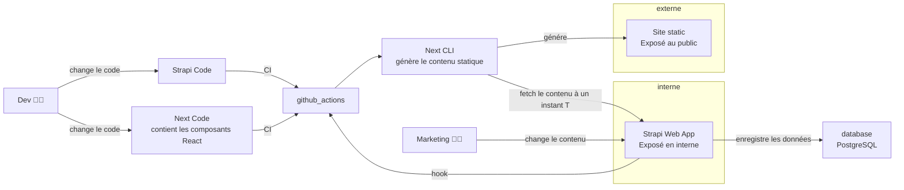

```mermaid
flowchart LR
    dev["Dev 🧑‍💻"]
    marketing["Marketing 🧑‍💼"]

    strapi_code["Strapi Code"]
    subgraph interne
        strapi_admin["Strapi Web App\nExposé en interne"]
    end
    next_code["Next Code\ncontient les composants React"]
    subgraph externe
        site_static["Site static\nExposé au public"]
    end
    database["database\nPostgreSQL"]
    next_cli["Next CLI\ngénère le contenu statique"]

    strapi_admin -->|hook| github_actions
    strapi_code -->|CI| github_actions
    next_code -->|CI| github_actions
    strapi_admin -->|enregistre les données| database
    github_actions --> next_cli
    next_cli -->|fetch le contenu à un instant T| strapi_admin
    next_cli -->|génére| site_static

    dev -->|change le code| strapi_code
    dev -->|change le code| next_code
    marketing -->|change le contenu| strapi_admin
```

SSG : Static Site Generator

SSR : Server Side Rendering

SPA : Single Page Application

Universal : SSG + SPA
